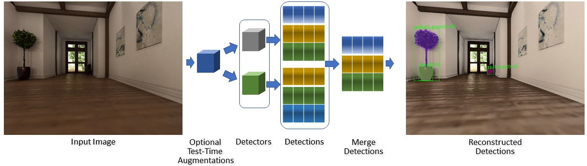

## Deep Ensembles For Probabilistic Object Detection 

### Overview


Probabilistic object detection is the task of detecting objects in images and
accurately quantifying the spatial and semantic uncertainties of the detection.
Quantifying uncertainty is critical in real-world robotic applications.
Traditional detection models can be ambiguous even when they provide a
high-probability output. Robot actions based on high-confidence, yet unreliable
predictions, can result in serious consequences. 

This repository provides source code for our 2021 CASE paper entitled 
"[AnUncertainty Estimation Framework for Probabilistic Object Detection](https://arxiv.org/pdf/2106.15007.pdf)." 
Our framework employs deep ensembles and Monte Carlo dropout for approximating
predictive uncertainty, and it improves upon the uncertainty estimation quality
of the baseline method. We evaluate our approach on publicly available
synthetic image datasets captured from sequences of video.

If you find this project useful, then please consider citing our work:
```bibtex
@inproceedings{lyu2021uncertainty,
  title={An Uncertainty Estimation Framework for Probabilistic Object Detection},
  author={Lyu, Zongyao and Gutierrez, Nolan B and Beksi, William J},
  booktitle={Proceedings of the IEEE International Conference on Automation Science and Engineering (CASE)},
  pages={},
  year={2021}
}
```

### Installation

### Usage

### License 

[Apache 2.0](https://github.com/robotic-vision-lab/Deep-Ensembles-For-Probabilistic-Object-Detection/blob/main/LICENSE)
